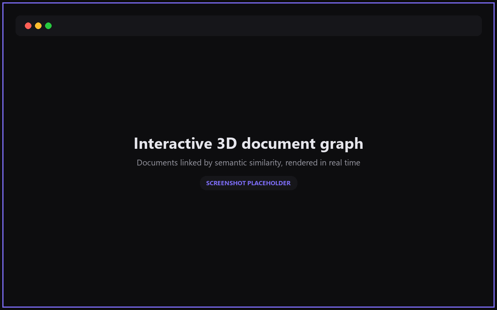
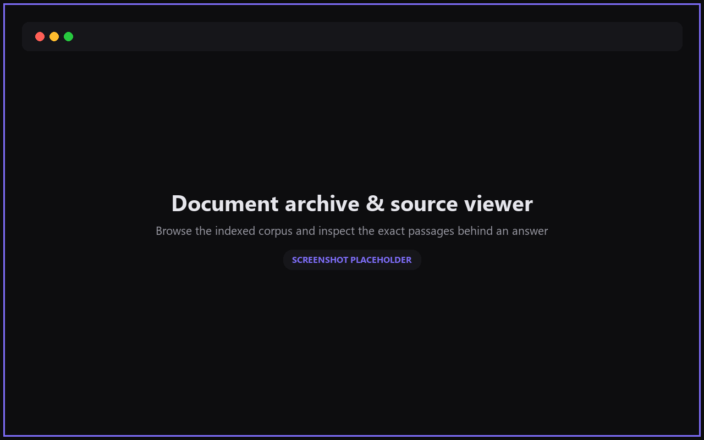
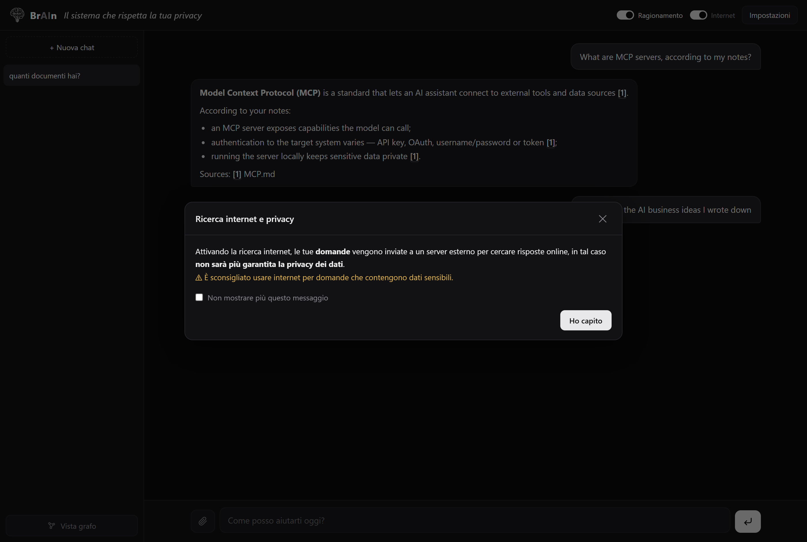
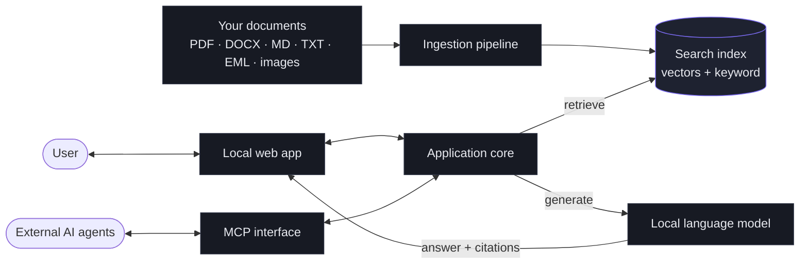

<div align="center">
  
  <h1>BrAIn</h1>
  <p><strong>A fully local, private RAG assistant that answers questions about your own documents — with nothing ever leaving your machine.</strong></p>
  <p><em>An end-to-end product: document ingestion, hybrid search, a local language model, a web UI, and a 3D knowledge graph — running entirely offline on ordinary hardware.</em></p>
</div>

---

Lawyers, accountants, clinics and consultants can't paste confidential files into cloud AI tools without breaking client confidentiality or data-protection law. **BrAIn** removes that trade-off: it runs entirely on the user's own computer, indexes their documents, and answers natural-language questions about them **with verifiable source citations** — no cloud, no external APIs, no data leaving the device.

It is not a demo or a notebook. It is a complete, hardened application: a full ingestion pipeline, a dual (semantic + keyword) search index, hallucination-resistant retrieval, a local LLM with mandatory citations, an interactive 3D document graph, an OCR path, hardware-adaptive configuration, and an integration server that lets other AI agents query the archive as a tool.

<div align="center">
  
  
  
  
</div>

## At a glance

- **100% local and private** — fully offline after the initial model download; nothing leaves the machine.
- **6 document formats** — PDF, DOCX, Markdown, TXT, EML, and images (via OCR).
- **Dual search index** — dense vectors *and* keyword (BM25), fused together.
- **Hardware-adaptive** — scales itself from a 1.5B model on a small laptop to a 14B model on a workstation, automatically.
- **Hardened** — a suite of 93 automated tests, and a full pass through an adversarial multi-agent code review.
- **Battle-tested** — validated on a real ~300-document corpus on a separate machine.
- **Zero graphics libraries** — the real-time 3D graph is a hand-written canvas renderer.

## Architecture



*Everything inside the diagram runs on the user's machine. The MCP interface lets external AI agents query the archive, receiving only the passages relevant to a given question — never the whole corpus.*

## Engineering highlights

The interesting problems weren't in wiring an LLM to a vector store — they were in making that pipeline *trustworthy and usable on real, modest hardware*.

- **Hallucination-resistant retrieval.** Small local models will confidently answer from irrelevant context. A contrast-based relevance gate decides when the system should say *"I found nothing relevant"* and skip the model entirely — instead of inventing an answer. (See the [code sample](code-sample/hybrid_retrieval.py) below.)
- **Hybrid semantic + keyword search.** Dense embeddings understand paraphrases but dilute rare exact terms (names, codes, invoice numbers); keyword search does the opposite. The two are fused with Reciprocal Rank Fusion so both are covered.
- **Reliable answers from small models.** Careful retrieval, mandatory citations (file + page), and query-intent routing (some questions are answered directly by the search engine, never touching the LLM) keep quality high on models that would otherwise wander.
- **Memory kept under control.** Streaming ingestion, lazy model loading, batched embeddings and on-disk indexes let a full RAG stack run on everyday laptops without exhausting RAM.
- **Hardware-adaptive by design.** The same build detects the machine it runs on and picks models, batch sizes and features accordingly — no manual tuning when moving to a different computer.
- **Real-time 3D visualization from embeddings.** The document graph is a custom physics-and-perspective renderer drawn directly on a canvas, with depth cueing and orbit/zoom navigation — and no external graphics libraries.
- **Robust and crash-safe.** Incremental hash-based indexing, an inter-process lock so two instances never corrupt the store, and data kept out of cloud-synced folders to avoid database corruption.
- **Privacy by design.** By default no data can leave the device; any exception (an optional web search) is an explicit, clearly-warned user choice.

## Selected code

A curated excerpt of the retrieval layer — the contrast-based relevance gate that keeps the system honest. Full file: [`code-sample/hybrid_retrieval.py`](code-sample/hybrid_retrieval.py).

```python
def passes_relevance_gate(best_similarity, candidate_similarities,
                          min_similarity, has_lexical_anchor):
    """Instead of a single hard threshold, the top hit is accepted only
    if it is defensibly relevant: high in absolute terms, OR clearing the
    threshold AND standing out from the median of the field (a real match
    'peaks'; an off-topic query stays flat), OR backed by an exact lexical
    anchor an off-topic query can never fabricate. Otherwise the system
    returns 'no relevant results' and never calls the model."""
    if has_lexical_anchor:
        return True
    mid = median(candidate_similarities) if candidate_similarities else 0.0
    strong = best_similarity >= min_similarity + 0.06
    peaked = (best_similarity >= min_similarity + 0.02
              and best_similarity - mid >= 0.03)
    return strong or peaked
```

## Design decisions

- **Local models over the cloud** — the whole value proposition is confidentiality, so the entire stack is offline; the trade-off (smaller models, slower generation) is bought back with stronger retrieval and citations.
- **A dual index instead of vectors alone** — semantic search alone silently misses exact identifiers; adding a keyword index and fusing the rankings fixes that class of failure.
- **A relevance gate instead of always answering** — for confidential, professional use, a wrong-but-confident answer is worse than an honest "nothing found", so the system is built to refuse rather than guess.
- **Adaptive configuration instead of a fixed profile** — the same build has to run on a 12 GB laptop and a 32 GB workstation, so hardware detection drives model and resource choices automatically.

## Tech stack

**Backend:** Python · FastAPI · Uvicorn
**Retrieval & AI:** ChromaDB · SQLite FTS5 · sentence-transformers (multilingual-e5) · cross-encoder reranking · Ollama
**Document processing:** PyMuPDF · python-docx · RapidOCR · Tesseract
**Frontend:** vanilla JavaScript · HTML5 Canvas
**Integration:** Model Context Protocol (MCP)

## Built with rigor

- **93 automated tests** across the core modules.
- Hardened through an **adversarial multi-agent code review** that surfaced and fixed several real defects (including data-loss and concurrency bugs) before they could reach a user.
- **Validated on a real ~300-document corpus** on a separate machine, then tuned from that feedback.
- Developed **iteratively and versioned**, with a maintained changelog.

## Note

This repository is a demonstrative showcase. Apart from the excerpt in `code-sample/`, the source code and internal implementation details are private and available on request.

## Contact

**Name:** Lorenzo Boschi<br>
**LinkedIn:** [linkedin.com/in/lorenzo-boschi](https://www.linkedin.com/in/lorenzo-boschi-842bb22a8/)<br>
**Email:** [lorenzoboschi27@gmail.com](mailto:lorenzoboschi27@gmail.com)
