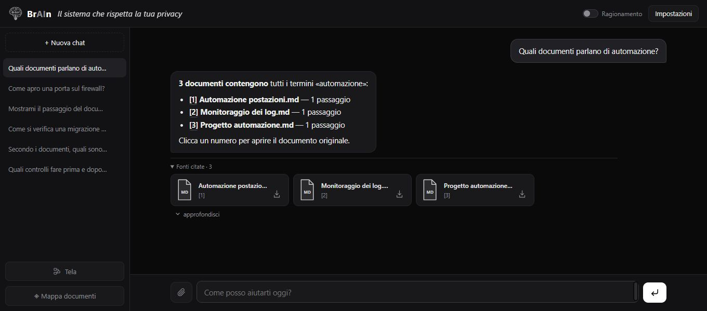
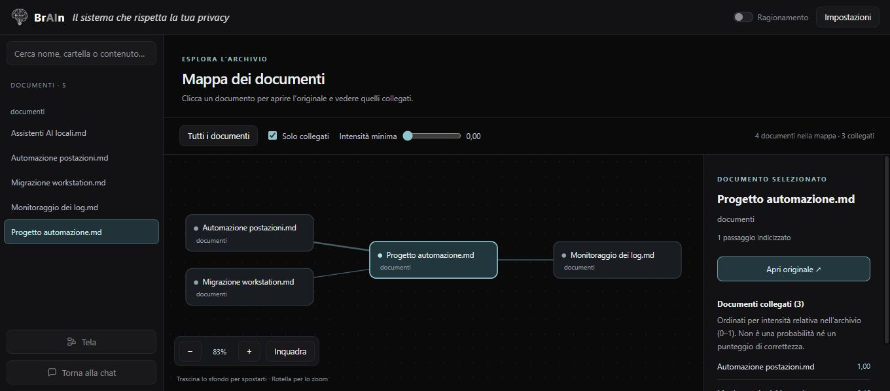
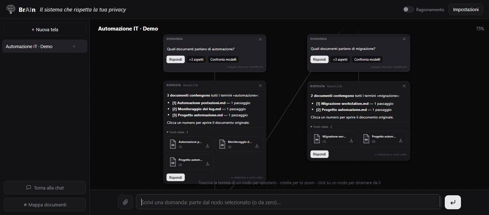
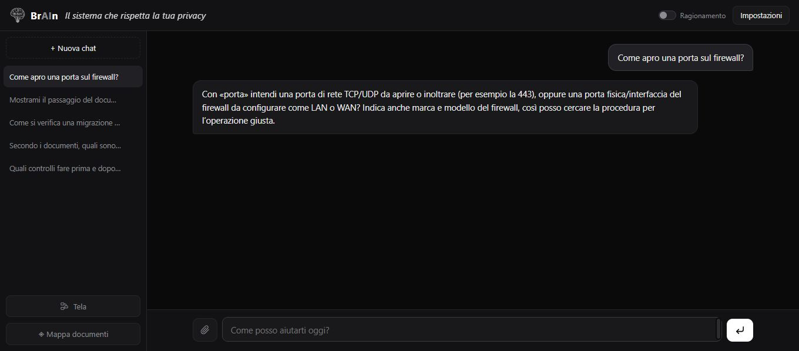
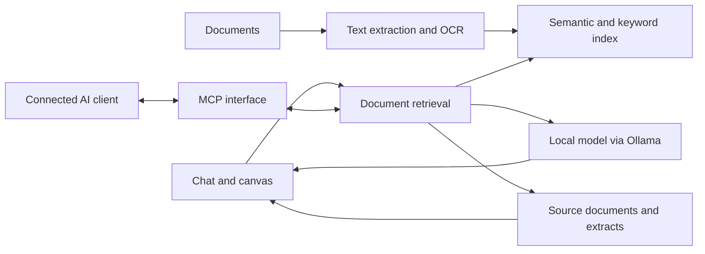

  
  <h1>BrAIn</h1>
  
<strong>Local AI for your documents</strong>

  
Find information, ask questions with source citations and explore answers on a visual workspace.

**Public project showcase · Application source code is private**

I built BrAIn to make a document archive easier to use: find the relevant file, read the passage behind an answer and continue from there. It combines local language models with semantic and keyword search, a browser interface and an MCP integration.

BrAIn can run offline once the required models are installed. Optional web search and MCP connections are described in the privacy section below.

## A look inside

These screenshots use fictional demonstration documents. The interface is in Italian.

### Find documents and check the sources

Ask a question or find documents on a topic. This example returns a document list directly, with references and source cards. Other questions use a local model to generate an answer from retrieved passages.

### Explore the document map

The **2D document map** supports search across file names, folders and indexed content. Explore related documents and open the originals. Connections indicate similarity between documents.

### Work through branches on the canvas

The canvas, called **Tela** in the interface, lets you continue from a particular answer, explore alternatives and combine selected branches into a synthesis. You can also compare responses from installed local models side by side. This example follows two document-search requests on one branch.

### Clarify before looking for a procedure

For an ambiguous request such as “open a firewall port,” BrAIn asks whether you mean a TCP/UDP port or a physical interface, and which firewall you are using. This specific clarification keeps the follow-up connected to the original question.

## What it does

- **Document search and questions:** combines semantic retrieval with keyword search for both natural-language questions and exact terms.
- **Local generation:** uses Ollama for answers from local models, with streaming output.
- **Source access:** shows citations and document cards alongside the answer. Opening the originals on Windows requires an associated application for the file format.
- **Document ingestion:** handles PDF, DOCX, Markdown, text and EML files, with OCR for scanned content and images.
- **Multiple ways to answer:** some supported requests return document listings or source extracts directly, without free-form model generation.
- **MCP integration:** makes the archive available to a connected AI client through search and question-answering tools.

## Privacy and data flows

| Mode | Where information goes |
|---|---|
| **Local operation** | Document processing, search and answer generation run on the computer. The necessary models must be available locally. |
| **Optional web search** | Queries are sent to an external search service when this option is enabled. |
| **MCP connection** | Tool results, including retrieved passages or locally generated answers, are returned to the connected client. A cloud-backed client can send those contents outside the computer. |

Files kept in a cloud-synced folder are still subject to that folder's sync settings.

## How the parts fit together

This is a high-level view of the document workflow. The connected client is outside the application's local processing boundary; optional web search is omitted from the diagram.

**Main technologies:** Python, FastAPI, ChromaDB, SQLite FTS5, sentence-transformers, Ollama, JavaScript and MCP.

## Validation and limits

The development record for **v0.6.13, dated 10 September 2026**, reports **1,241 passing automated tests**, covering retrieval regressions, citations, document handling, persistence and application behaviour. This is a historical result, not a new test run for the showcase. See the [validation note](VALIDATION.md) for scope and limitations.

Retrieval can miss relevant passages, OCR can lose information and local models can produce unsupported statements. A citation should be opened and checked. Performance depends on the model, hardware and documents. BrAIn remains a project under active development.

## About the project

I develop BrAIn with AI-assisted programming tools, including Claude Code and Codex. I define the requirements, guide implementation and test the results, using my understanding of the architecture to investigate problems and refine the application.

This repository presents the application, selected design choices and demonstration images. The full source code, working document collections and internal configuration are private.

**Lorenzo Boschi** · [LinkedIn](https://www.linkedin.com/in/lorenzo-boschi-842bb22a8/) · [GitHub](https://github.com/LorenzoBoschi)
